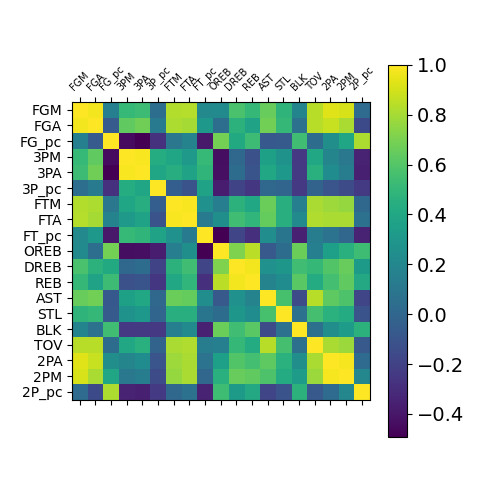

# NBA Complementarity Algo

## Step1: Pre Processig raw data

**Scripts**:
- *pre_process_raw_data.py*"

Join stats for every player (*raw_data/players.csv*) 
with the information about their roles (raw_data/nbastats.csv)

In case one player had more than one role, choose the role(s) 
which appeared the most during different seasons.

Since Stas have different magnitude, scale the data using Min_Max Scaler

**Data Input**: 
- *raw_data/players.csv* 
- *raw_data/nbastats.csv*

**Data Output**: 
- *data/players_post_input.csv*
- *data/scaled_features_post_input.csv*

## Step2: Correlation Analysis

**Scripts**:
- *correlation_analysis.py*

Correlation Analysis of the Dataset.

Including all the (scaled) features, the corr analysis Matrix looks like:

There are some yellow high correlated blocks,
regarding these variables:

- FGM/A: Field goals made/attempted
- FTM/A: Free throws made/attempted
- 2PA/M 3PA/M : 2-3 Points Made/Attempted
- OREB/DREB/REB: Offensive Defensive Rebounds

For Fields goals, Free Throws, Point Made/Attemped I decided to work with the correspondant %stats, while
I decide to keep the distinction between offensive and defensive bounds.

**Data Input**: 
- *data/players_post_input.csv* 
- *data/scaled_features_post_input.csv*

**Data Output**: 
- *data/players_post_corr.csv*
- *data/scaled_features_post_corr.csv*

## Step3: PCA and interpretation in ShinyApp

**Scripts**:
- *pre_processing.py*

Principal Component Analysis with scaled data
From The Pca Analysis, we can see that the first 3 PC explain about 60% of the total variance.
It's not trivial then to compare the loadings and deduce complete information about the dataset variability, 
but one interesting thing is that looking and the scores of the observations of the first two PC, we can see a sort of 
overlapping between the green *Point Guard* (PG) line and the purple *Shooting Guard* line (SG).
Again, could be misleading since the first 2 pc togheter explain about 50% f the variability

plot obs vs first 2 pc

 
**Data Input**: 
- *data/players_post_corr.csv* 
- *data/scaled_features_post_corr.csv*

**Data Output**: 
- *data/df_principal_componenets_scld.csv*

## Step4: Overall Similarity  

**Scripts**:
- *similarity.py*

### Complementarity definition
The relative complementarity of the two players is calculated as the ratio between the distance between two players
and the maximum distance between players in the dataset.

The distance used is the standard euclidean distance:

    

So the complementarity formula is:

The similarity formula is just the "complement of the complementarity:"

This approach has the cons that:
- There are some players that are 100% complementary/similar to others and that's not really realistic

But has the pro that the algorithm doesn't only depend by the absolute stats of the players, 
but it takes into account of the contest in which the players are into.

**Data Input**: 
- *data/players_post_corr.csv* 
- *data/scaled_features_post_corr.csv*

**Data Output**: 
- *output_data/ovrl_distances.csv*

## Step5: Similarity by Role  

**Scripts**:
- *similarity_by_role.py*

Same as Step 4, but the maximum distance is calcolated per every role.

**Data Input**: 
- *data/players_post_corr.csv* 
- *data/scaled_features_post_corr.csv*

**Data Output**: 
- *output_data/by_roles_overall_distances.csv*

